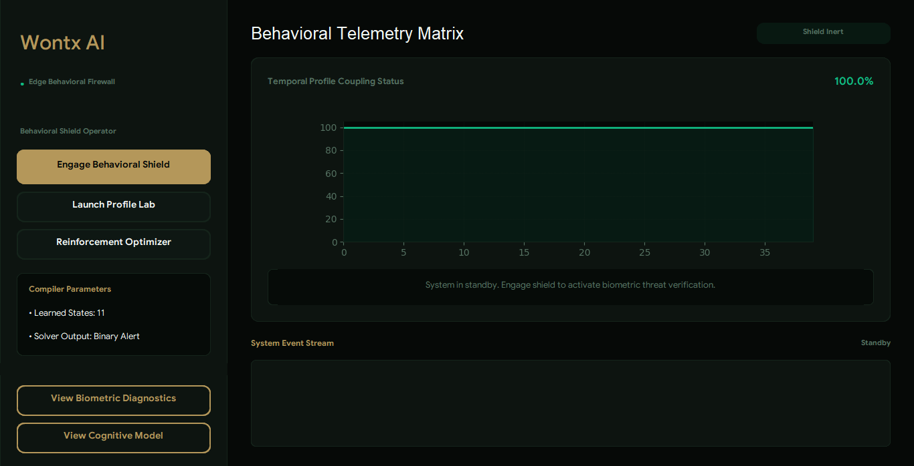
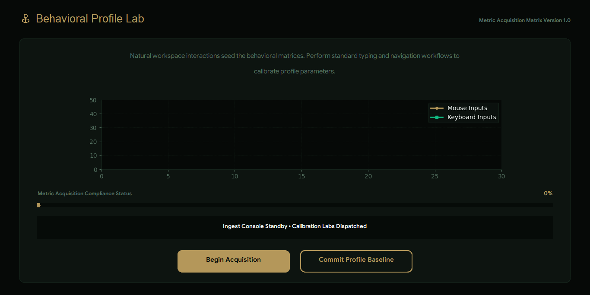
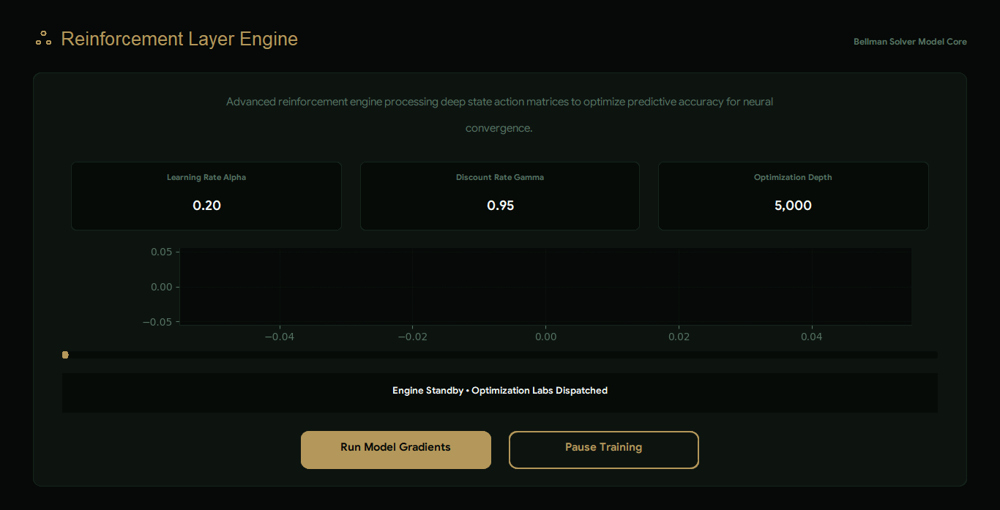
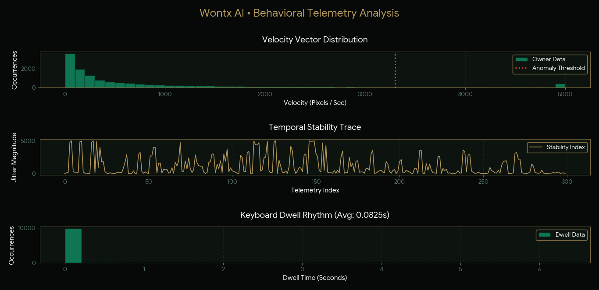
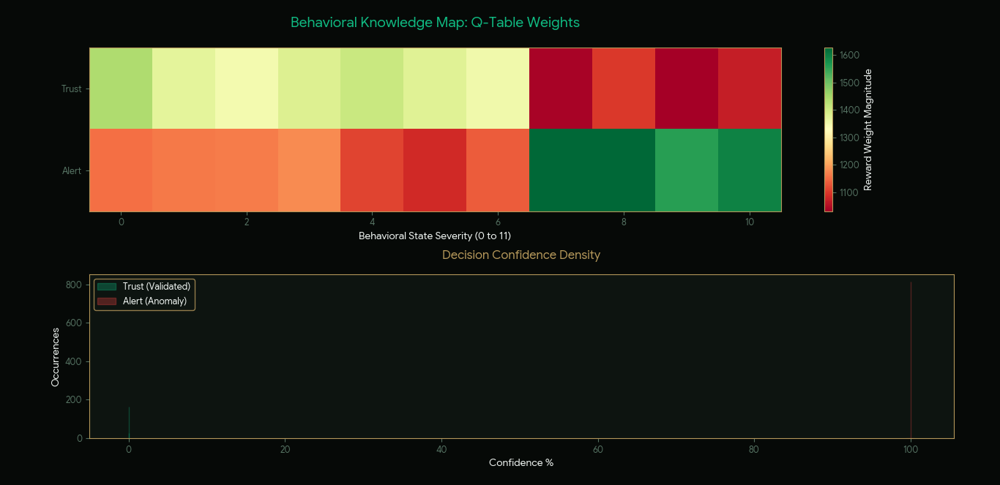

# WONTX AI
**Behavioral Firewall & Biometric Integrity System**

WONTX AI is an Artificial Intelligence system designed to establish a behavioral firewall around digital workspaces. By monitoring high resolution biometric patterns, specifically mouse velocity and keyboard dwell time, the system maintains biometric integrity to ensure that the active user remains the authorized owner of the session.

## About the System 
WONTX AI is a security framework that protects your workstation through real time behavioral biometrics. This project represents a shift from static password based security to dynamic, AI driven behavioral authentication. It deploys reinforcement learning to analyze and adapt to human machine interaction patterns.

## Purpose
Unlike standard security tools that rely on credentials, WONTX AI provides continuous, background verification:

* **Biometric Profiling:** Utilizes a custom reinforcement learning agent to map unique user behavioral signatures.
* **Zero Interaction Security:** Operates as a behavioral shield, minimizing user friction while maximizing detection sensitivity.
* **Modular Architecture:** Designed for seamless integration into diverse hardware and software environments.

## Project Visuals
| Dashboard | Profile Lab | Reinforcement Optimizer |
| :---: | :---: | :---: |
|  |  |  |

| Biometric Diagnostics | Cognitive Model |
| :---: | :---: |
|  |  | 

## System Demo
[Watch the WONTX AI Demo Video](Demo_Video.mp4)

## How to Run the Project
1. Clone this repository: `git clone [YOUR_REPO_LINK]`
2. Open the project folder in your code editor.
3. Install all required libraries: `pip install customtkinter pynput numpy matplotlib`
4. Launch the dashboard by running: `python dashboard.py`
5. **Enrollment:** Click **Launch Profile Lab**, perform your natural mouse movements and keyboard typing, then click **Commit**. This action automatically creates the local database.
6. **Training:** Return to the dashboard and click **Reinforcement Optimizer**. Click **Run Model Gradients** to train the agent. This process automatically creates the Q table.
7. **Diagnostics:** Run `analyzer.py` to view biometric graphs of stored data, or run `check_brain.py` to see the agent brain training graph based on 11 states.
8. **Engage:** Return to the dashboard and click **Engage Behavioral Shield**. Move your cursor or use the keyboard to test the system. The agent will monitor your behavior in real time. If the trust score falls below 70 percent, you will see warning logs. If it drops below 30 percent, the system will lock your device.

## Technologies Used
* **Core AI:** Python, NumPy, Pandas, Reinforcement Learning
* **UI Interface:** Customtkinter
* **Data Handling:** SQLite, Python datetime serialization
* **Visualization:** Matplotlib, TkAgg

## Documentation
* [View System Architecture Report](docs/wontx_ai_report.pdf)
* [Presentation Slides](docs/wontx_ai_presentation.pptx)
* [File for Project Explanation and Simulation](docs/Simulation.html)

## License
This project is licensed under the Apache License 2.0. See the LICENSE file in the root directory for full legal terms.

## Developed By
Areej Fatima

## Course 
Artificial Intelligence

## Instructor
Mr. Faisal Hafeez

### Depratment of Information Technology
### University of Layyah
